# PRIMAL FRONTIER — Last of the Primal

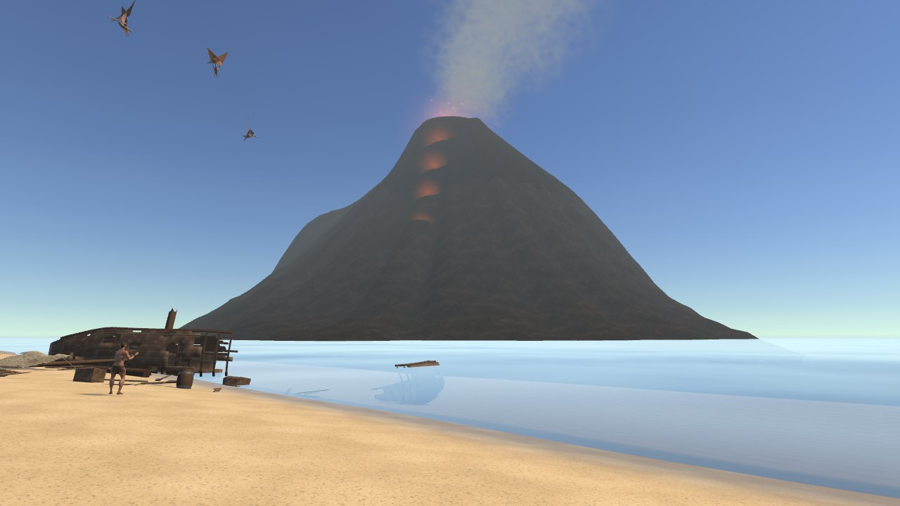

**Game sinh tồn góc nhìn thứ ba thời tiền sử, một người chơi.** Bạn là người sống sót duy nhất sau một cơn bão, tỉnh
dậy trên bãi biển của một hòn đảo nơi khủng long vẫn còn sống. Tìm nước sạch, nhóm lửa, làm công cụ, dựng chỗ trú và
sống qua những đêm đầu tiên, trong khi ngọn núi lửa bên kia biển vẫn đang bốc khói.

> *English:* PRIMAL FRONTIER is an original single-player, third-person prehistoric survival game made in Unity 6 (URP)
> for PC and phones. A shipwreck survivor must find clean water, fire, tools and shelter on a small island ruled by
> dinosaurs. Every model, animation, sound and shader in this project is original.

---

## Mục lục
1. [Giới thiệu](#giới-thiệu)
2. [Ảnh trong game](#ảnh-trong-game)
3. [Cách chơi](#cách-chơi)
4. [Nội dung game](#nội-dung-game)
5. [Lý thuyết thiết kế game](#lý-thuyết-thiết-kế-game)
6. [Kỹ thuật và cách mở dự án](#kỹ-thuật-và-cách-mở-dự-án)
7. [Bản quyền và nguồn tài sản](#bản-quyền-và-nguồn-tài-sản)
8. [Trạng thái dự án](#trạng-thái-dự-án)

---

## Giới thiệu

Con tàu của bạn vỡ tan trong cơn bão đêm. Sáng hôm sau, bạn nằm trên cát cạnh xác tàu, trong tay chỉ còn cuốn nhật ký
của thuyền trưởng. Phía sau bãi biển là rừng rậm, đồng cỏ có đàn khủng long ăn cỏ, một con suối, một cái ao và một hang
đá. Xa ngoài biển, một ngọn núi lửa thỉnh thoảng lại gầm lên và phun khói.

Bạn không phải người hùng. Bạn là con người nhỏ bé giữa một hệ sinh thái cổ đại: phải hiểu nó, tránh nó, và chỉ chiến
đấu khi không còn cách nào khác.

**Thể loại:** sinh tồn, khám phá, hành động nhẹ &nbsp;·&nbsp; **Góc nhìn:** thứ ba &nbsp;·&nbsp; **Nền tảng:** PC (chuột + bàn phím,
tay cầm), điện thoại (cảm ứng) &nbsp;·&nbsp; **Engine:** Unity 6000.3.10f1, URP

---

## Ảnh trong game

| | |
|---|---|
| 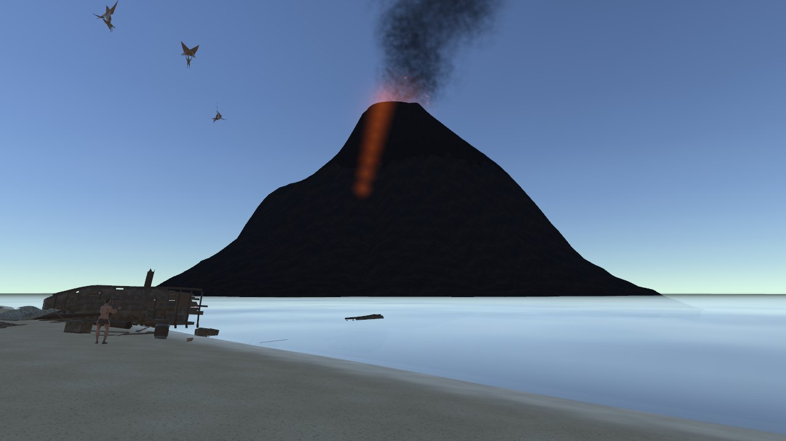 | 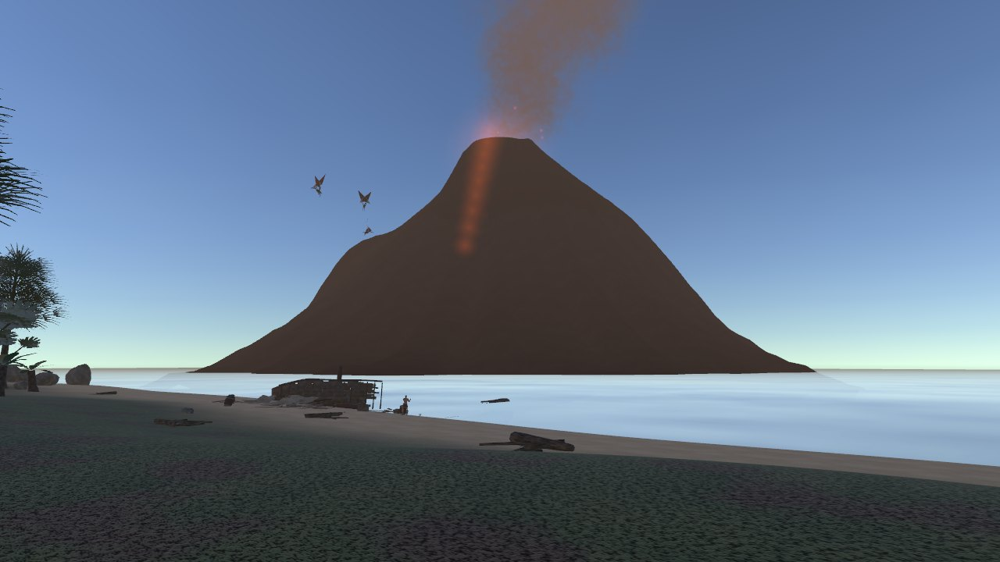 |
| *Ban đêm: miệng núi lửa và dòng dung nham phát sáng qua màn sương biển* | *Hoàng hôn nhìn từ khu trại, khói núi lửa bay theo gió* |
| 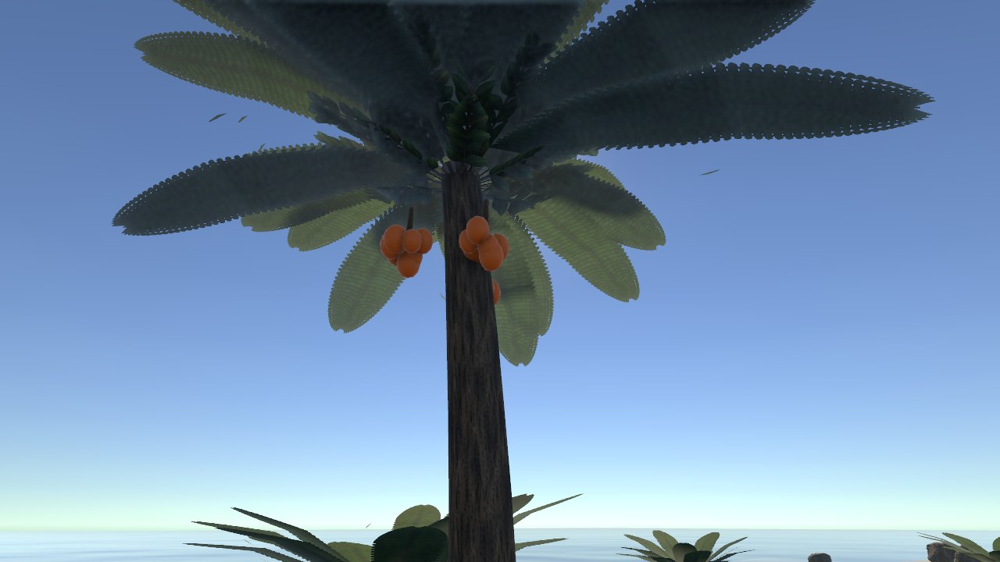 | 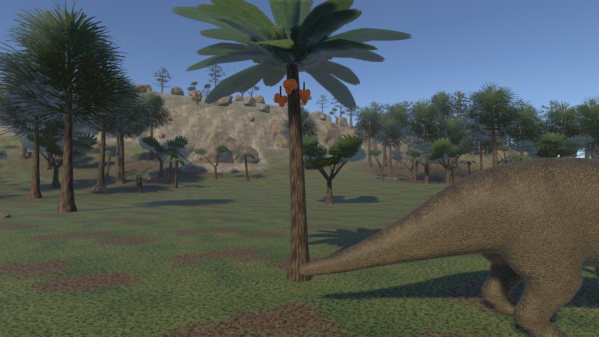 |
| *Cây dương xỉ cọ có chùm trái ngay dưới tán: phải leo lên mới hái được* | *Đồng cỏ: cây ăn trái và một con khủng long ăn cỏ đang đi ngang* |
| 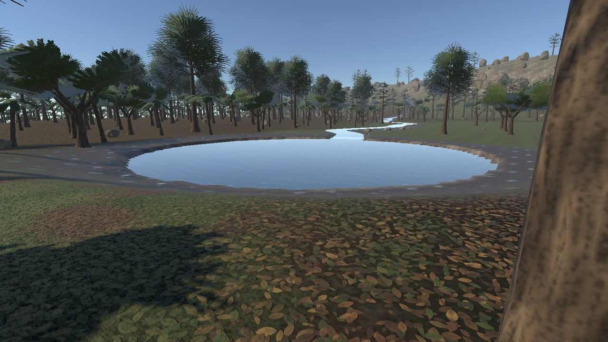 | 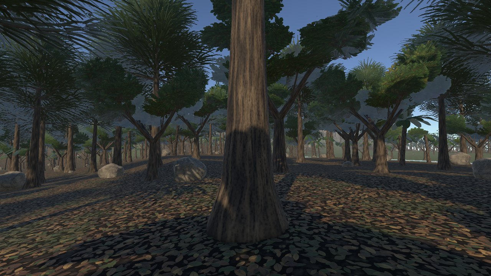 |
| *Ao nước ngọt và con suối: nước trông trong nhưng phải đun sôi trước khi uống* | *Trong rừng: nhiều gỗ, nhiều bóng râm, và cũng nhiều thứ đang rình* |
| 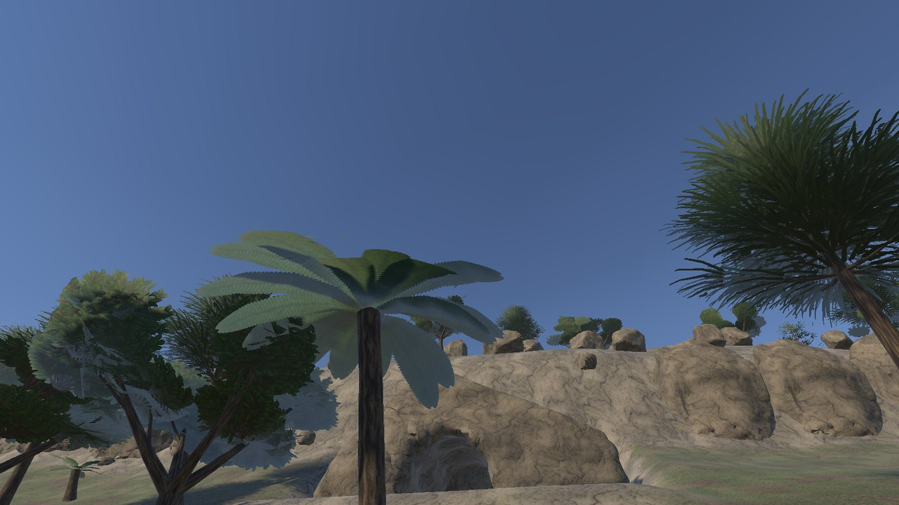 | 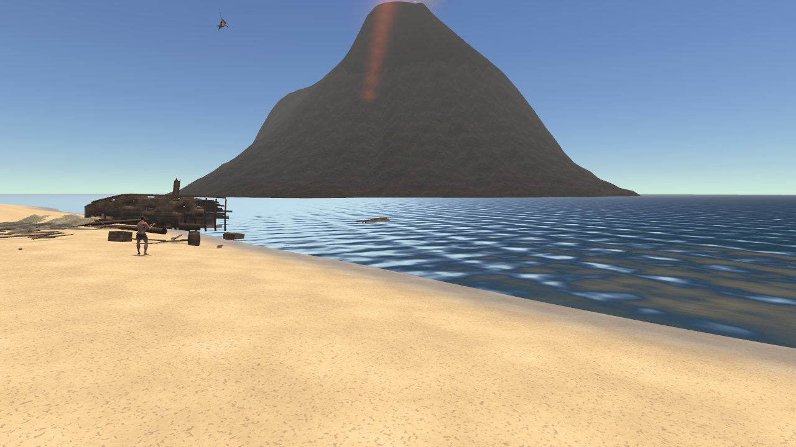 |
| *Cửa hang dưới vách đá* | *Mặt biển với sóng, ánh nắng lấp lánh, và gợn mưa khi trời mưa* |

**Các loài trên đảo** (mô hình do chính dự án tạo, không lấy từ game khác):

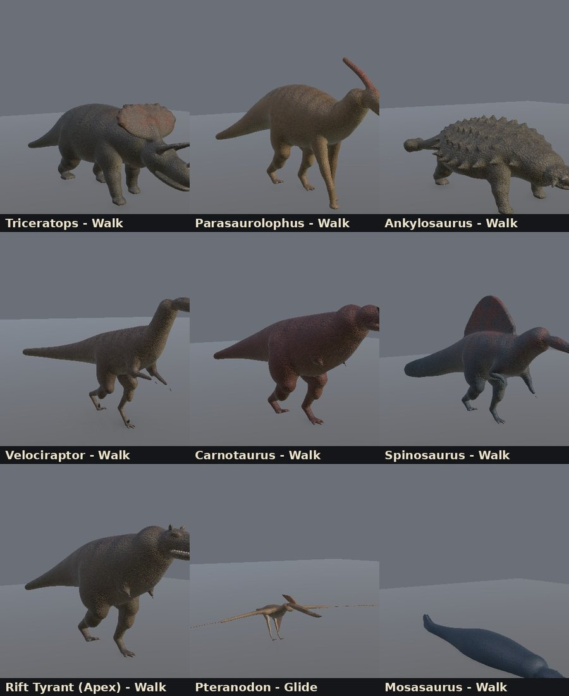 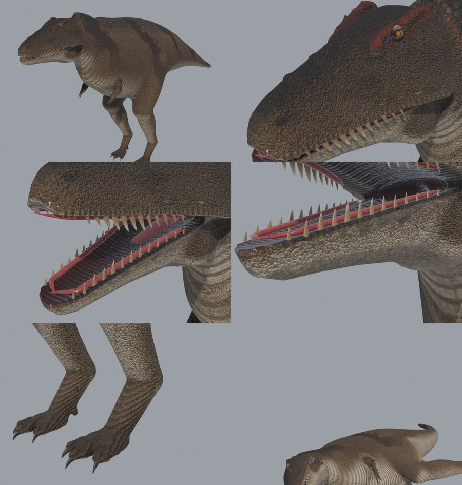

| Mắt khủng long (con ngươi dọc cho loài săn mồi, tròn cho loài ăn cỏ) | Nhân vật: 47 động tác |
|---|---|
| 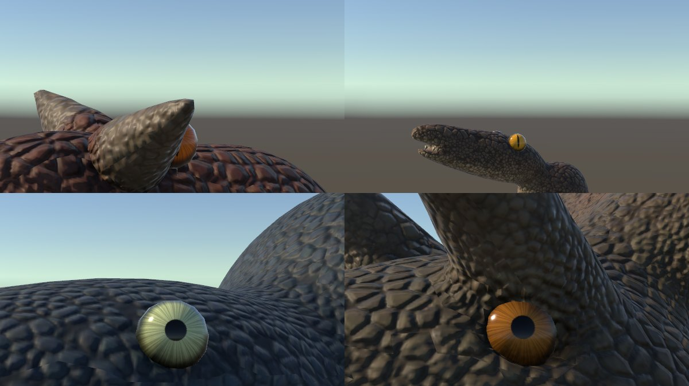 | 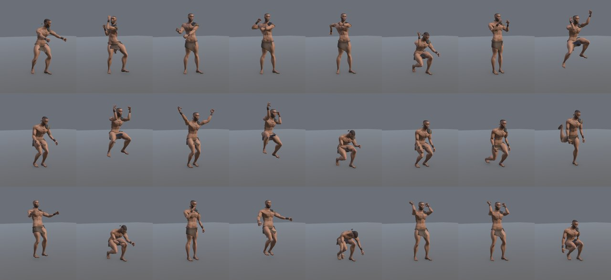 |

---

## Cách chơi

### Mục tiêu
Sống sót. Giữ cho **đói, khát, thể lực, thân nhiệt** ở mức an toàn, tránh **bệnh** và **chấn thương**, khám phá hòn đảo
và đọc nhật ký để hiểu chuyện gì đã xảy ra. Phần hướng dẫn 19 bước dẫn bạn qua ngày đầu tiên và đêm đầu tiên.

### Vòng lặp sinh tồn
```
  nhặt / khai thác  ->  chế tạo công cụ  ->  lửa + nước sạch + thức ăn  ->  chỗ trú
        ^                                                                 |
        |______  khám phá xa hơn (rủi ro cao hơn, phần thưởng lớn hơn)  <__|
```

### Điều khiển PC
| Hành động | Phím |
|---|---|
| Di chuyển / chạy / đi chậm | WASD / Shift / Alt |
| Nhìn / phóng to thu nhỏ | Chuột / + và - |
| Nhảy / ngồi (lén) | Space / C |
| Tương tác / giữ để khai thác | E / giữ E |
| Tấn công / ngắm (ném giáo, bắn cung) | Chuột trái / chuột phải |
| Đòn mạnh (giáo, kiếm) | Giữ chuột trái |
| **Né (lăn)** | **V** |
| Thanh công cụ | 1-8 hoặc lăn chuột |
| Túi đồ / chế tạo / nhật ký / tạm dừng | Tab hoặc I / Q / J / Esc |
| **Bản đồ lớn** | **M** |
| Thả đồ / xoay công trình | G / R |
| Leo cây: lên / xuống / hái trái / buông | W / S / E / Space |
| **Bảng phím trong game** | **F1** (hoặc Esc > CONTROLS / PHÍM) |

Bảng đầy đủ (tiếng Việt + English): [Documentation/CONTROLS.md](Documentation/CONTROLS.md).

Tay cầm: di chuyển, camera, nhảy, ngồi, tương tác, tấn công, ngắm, né, tạm dừng.

### Điều khiển điện thoại
| Vùng màn hình | Nút (nhãn trong game) |
|---|---|
| Nửa trái | cần điều khiển nổi, xuất hiện ngay dưới ngón cái |
| Nửa phải | vuốt để nhìn |
| Góc phải dưới | **ATTACK** (giữ = đòn mạnh), **JUMP**, **DODGE** (né), nút theo ngữ cảnh **USE / CLIMB / PICK / DRINK / FILL** (chỉ hiện khi có thứ để dùng), **AIM** (chỉ khi cầm giáo hoặc cung) |
| Cạnh cần điều khiển | **RUN** (bật/tắt chạy), **CROUCH** (ngồi) |
| Góc trái trên | **II** (tạm dừng), **BAG** (túi), **CRAFT** (chế tạo), **BOOK** (nhật ký) |
| Thanh công cụ / bản đồ nhỏ | chạm vào ô để cầm đồ, chạm bản đồ để mở bản đồ lớn |
| Khi xây dựng | **BUILD**, **ROTATE**, **CANCEL** |

### Mẹo sống sót
- **Nước ao và suối là nước bẩn.** Múc vào bình, đứng cạnh đống lửa đang cháy và chọn **Boil water** (đun nước, khoảng 8 giây). Uống
  nước bẩn có 20 % khả năng bị đau bụng: khát nhanh hơn và hồi thể lực chậm hơn. Nước biển thì không uống được.
- **Trái cây ở trên cao.** Leo cây tốn thể lực; bị thương hoặc hết sức là rơi xuống. Mỗi chùm cho 3 trái, mọc lại sau hơn một ngày.
- **Khủng long luôn báo trước.** Trước mỗi cú cắn hoặc húc, con vật dừng lại, quay về phía bạn, gầm gừ và rụt đầu lấy
  đà. Đó là lúc bấm **Né**: 0,34 giây đầu của cú lăn bạn không bị trúng đòn.
- **Ngồi xuống để đi lén** và **đi vào ban đêm**: tầm nhìn của thú giảm 40 %. Nhưng ban đêm lạnh, cần lửa.
- **Đàn thú ăn cỏ** sẽ đứng nhìn bạn, và cả đàn bỏ chạy nếu một con hoảng. Đừng dồn chúng vào đường cùng.
- **Theo dõi bản đồ nhỏ**: lửa trại, chỗ trú, nước, nơi đã khám phá và thú đang ở gần (đỏ là nguy hiểm).
- **Nhìn trời.** Mây kéo đến thường là sắp mưa: mưa làm ướt người, lạnh hơn và lửa cháy nhanh hết củi.

---

## Nội dung game

**Hòn đảo:** bãi biển và xác tàu, khu trại, rừng rậm, đồng cỏ, ao và suối nước ngọt, hang đá, vách đá; ngọn núi lửa
đang hoạt động bên kia biển (cảnh nền, không thể tới).

**Sinh tồn:** đói, khát, thể lực, thân nhiệt, độ ướt, bệnh; ngày và đêm; thời tiết Nắng, Nhiều mây, Mưa, Bão (có sét).

**Chế tạo** (7 nhóm: Tất cả, Công cụ, Vũ khí, Thức ăn, Nước, Xây dựng, Sinh tồn): dây thừng, đá cầm tay, rìu đá, cuốc đá,
búa đá, dao đá lửa, giáo đá, cung và tên, đuốc, bình nước bằng da, thịt nướng, lửa trại, chỗ trú, rương đồ, ổ ngủ.

**Chiến đấu:** giáo (đâm, combo 2 đòn, đòn mạnh, ném), cung, dao; né lăn; máu và vết thương có thể chỉnh
(Tắt / Giảm / Bình thường).

**Các loài:**
| Loài | Vai trò | Tính khí |
|---|---|---|
| Triceratops | đàn gần đồng cỏ | phòng thủ |
| Parasaurolophus | đàn, hay kêu gọi nhau | hiền, bỏ chạy |
| Ankylosaurus | chậm, bọc giáp | phòng thủ |
| Velociraptor | thợ săn nhanh | săn mồi |
| Carnotaurus | lãnh thổ trong đảo | giữ lãnh thổ |
| Spinosaurus | ở gần suối | giữ lãnh thổ |
| Rift Tyrant | kẻ săn mồi đỉnh (thiết kế riêng của dự án) | giữ lãnh thổ |
| Pteranodon | lượn quanh xác tàu | cảnh nền |
| Mosasaurus | ngoài khơi | cảnh nền |

**Câu chuyện:** đoạn mở đầu (bão, đắm tàu, tỉnh dậy trên bãi biển), nhật ký với các trang câu chuyện, trang ghi chép về
từng loài, về trái cây, nước sôi và bệnh tật; hướng dẫn 19 bước có la bàn chỉ mục tiêu.

---

## Lý thuyết thiết kế game

Phần này giải thích *vì sao* game được làm như vậy.

### 1. Bốn trụ cột
1. **Sinh tồn có ý nghĩa.** Mỗi chỉ số buộc người chơi phải lên kế hoạch, không chỉ là con số giảm dần. Ví dụ nước:
   nước ngay trước mặt nhưng bẩn, muốn an toàn phải có lửa, muốn có lửa phải có gỗ và đá. Một nhu cầu kéo theo cả chuỗi hành động.
2. **Thế giới sống.** Khủng long ăn, uống, nghỉ, quan sát, bỏ chạy theo đàn và phản ứng với tiếng động, dù người chơi
   có ở đó hay không. Người chơi là một phần của hệ sinh thái, không phải trung tâm của nó.
3. **Nguy hiểm đọc được.** Cái chết phải là lỗi của người chơi, không phải của game. Mọi đòn tấn công đều có dấu hiệu
   báo trước (dừng lại, quay đầu, gầm, rụt đầu) và luôn có cách thoát (né có khoảnh khắc bất tử, hoặc tránh xa từ đầu).
4. **Nhỏ mà sâu.** Chỉ một hòn đảo nhỏ, nhưng mỗi vùng có lý do để quay lại: gỗ ở rừng, đá ở vách, nước ở ao, trái trên cây, thú ở đồng cỏ.

### 2. Mô hình MDA (Mechanics, Dynamics, Aesthetics)
| Cơ chế (luật của game) | Diễn biến (điều xảy ra khi chơi) | Cảm xúc (người chơi thấy gì) |
|---|---|---|
| Nước bẩn, đun sôi cạnh lửa, bệnh 20 % | lên kế hoạch đi lại giữa ao và trại, liều uống khi quá khát | căng thẳng, cân nhắc, nhẹ nhõm khi có nước sạch |
| Ngày và đêm, nhiệt độ, lửa trại | phải về trại trước khi trời tối | áp lực thời gian, cảm giác "nhà" |
| Thú có tầm nhìn, thính giác, ngồi và đêm làm giảm phát hiện | đi lén, vòng đường, quan sát trước khi hành động | hồi hộp, thông minh |
| Dấu hiệu tấn công và cú né | học nhịp của từng loài | làm chủ, công bằng |
| Trái cây trên cao, leo tốn sức | rủi ro nhỏ để lấy phần thưởng ngon | thử thách, khám phá |

### 3. Rủi ro và phần thưởng
Vùng gần trại an toàn nhưng tài nguyên ít; càng đi xa (rừng sâu, suối, hang) càng nhiều tài nguyên và càng nhiều kẻ săn
mồi. Ngọn núi lửa ở chân trời là "lời hứa" về một nơi chưa tới được, giữ cho người chơi tò mò.

### 4. Nhịp độ
Chu kỳ ngày đêm là đường cong căng thẳng: buổi sáng khám phá, buổi chiều chuẩn bị, hoàng hôn là hạn chót, ban đêm là
thử thách. Thời tiết (mây, mưa, bão) thêm những đợt căng thẳng không báo trước, và tiếng gầm của núi lửa thỉnh thoảng
nhắc rằng hòn đảo này vẫn đang sống.

### 5. Dạy người chơi mà không cần giảng
Phần hướng dẫn là một chuỗi mục tiêu nhỏ (đến xác tàu, lấy gỗ, làm rìu, tìm nước...) với la bàn chỉ đường, thay vì một
bảng chữ dài. Nhật ký ghi lại những gì nhân vật tự phát hiện ("nước ao trông sạch nhưng không phải vậy"), nên kiến thức
đến từ trải nghiệm.

### 6. Dễ đọc trên điện thoại
Chỉ hiện nút khi cần: nút USE chỉ xuất hiện khi có thứ để dùng và tự đổi nhãn (CLIMB, PICK, DRINK, FILL); nút AIM chỉ
có khi cầm giáo hoặc cung; khi xây thì nút ATTACK thành BUILD. Màn hình gọn giúp người chơi nhìn thế giới thay vì nhìn nút.

---

## Kỹ thuật và cách mở dự án

- **Engine:** Unity 6000.3.10f1, Universal Render Pipeline, Input System, C#.
- **Mô hình:** tạo bằng code trong Blender 5.2 (`Tools/BlenderPipeline`), nhập vào Unity bằng công cụ riêng có kiểm tra tự động.
- **Shader tự viết:** nước biển (`PF/Water`), cảnh xa (`PF/Landmark Lit`), hạt phát sáng không bị sương che.
- **Toàn bộ game nằm trong Hierarchy:** hệ thống, nhân vật, khủng long, giao diện đều là object trong scene, chỉnh tay
  rồi Ctrl+S là lưu, không cần sửa code.

**Mở và chạy:**
1. Mở thư mục dự án trong Unity 6000.3.10f1. Editor tự mở `Assets/_Project/Scenes/Island_VerticalSlice.unity`.
2. Bấm Play. Màn hình tiêu đề > New Game > đoạn mở đầu (Space / Esc để bỏ qua) > hướng dẫn.
3. Build Windows: `Primal Frontier > Build > Windows`.

**Tài liệu:**
| Tài liệu | Nội dung |
|---|---|
| [Architecture](Documentation/PRIMAL_FRONTIER_ARCHITECTURE.md) | cấu trúc scene, thư mục, trạng thái, input, lưu game, công cụ editor |
| [Systems](Documentation/PRIMAL_FRONTIER_SYSTEMS.md) | từng hệ thống và thông số |
| [Character pipeline](Documentation/PRIMAL_FRONTIER_CHARACTER_PIPELINE.md) | nhân vật, động tác, khủng long, mắt |
| [VFX & shader guide](Documentation/PRIMAL_FRONTIER_VFX_SHADER_GUIDE.md) | shader, hiệu ứng, núi lửa, thời tiết |
| [Mobile guide](Documentation/PRIMAL_FRONTIER_MOBILE_GUIDE.md) | điều khiển cảm ứng, cấu hình đồ họa cho điện thoại |
| [Phase 2 status](Documentation/PRIMAL_FRONTIER_PHASE2_STATUS.md) | cái gì đã kiểm tra, cái gì chưa |
| [Hướng dẫn bảo trì](Documentation/HUONG_DAN_BAO_TRI.md) | chỉnh sửa game bằng tay (tiếng Việt) |

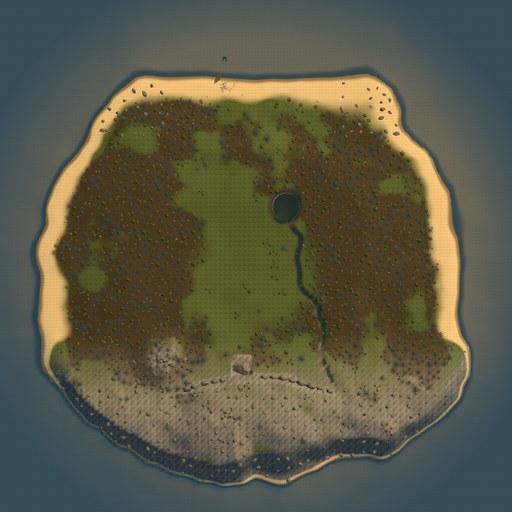

---

## Bản quyền và nguồn tài sản

Mọi mô hình, động tác, âm thanh, texture và shader trong dự án đều được tạo riêng cho PRIMAL FRONTIER. Dự án không dùng
tài sản, mã nguồn hay thiết kế nhân vật của game khác. Chi tiết nguồn gốc từng loại tài sản:
[IP_AND_ASSET_PROVENANCE.md](Documentation/IP_AND_ASSET_PROVENANCE.md).

---

## Trạng thái dự án

Đây là bản **vertical slice**: một hòn đảo nhỏ, ngày và đêm đầu tiên. Các hệ thống của Phase 2 (hoạt ảnh mới, leo cây,
né, nước sạch, bản đồ nhỏ, điều khiển cảm ứng, núi lửa, thời tiết, mắt khủng long) đã được làm và biên dịch không lỗi;
phần lớn **chưa được người thật chơi thử** và **chưa build lên điện thoại**. Xem bảng chi tiết ở
[Phase 2 status](Documentation/PRIMAL_FRONTIER_PHASE2_STATUS.md).

Đợt nâng cấp nhân vật (tháng 9/2026) thêm những phần sau.

- **Nhân vật:** xương xoắn cẳng tay, trọng số vai / cẳng tay, bàn tay thả lỏng.
- **Vũ khí:** kiếm đá lửa (mẫu gốc, 3 đòn nối, đòn mạnh hai tay), giáo cầm hai tay, cung ở tay trái.
- **Di chuyển:** đi ngang / lùi khi ngắm.
- **Săn bắn:** xác thú để xẻ thịt.
- **Thế giới và chế tạo:** 150 bụi cây rung khi đi qua, 9 công thức chế tạo mới.
- **Khung cảnh:** gió cho cây, tro và hơi nóng núi lửa, bầu trời sao.

Chi tiết và phần chưa làm: [Upgrade status](Documentation/Upgrade/IMPLEMENTATION_STATUS.md), kiểm thử: [QA report](Documentation/Upgrade/QA_REPORT.md).
